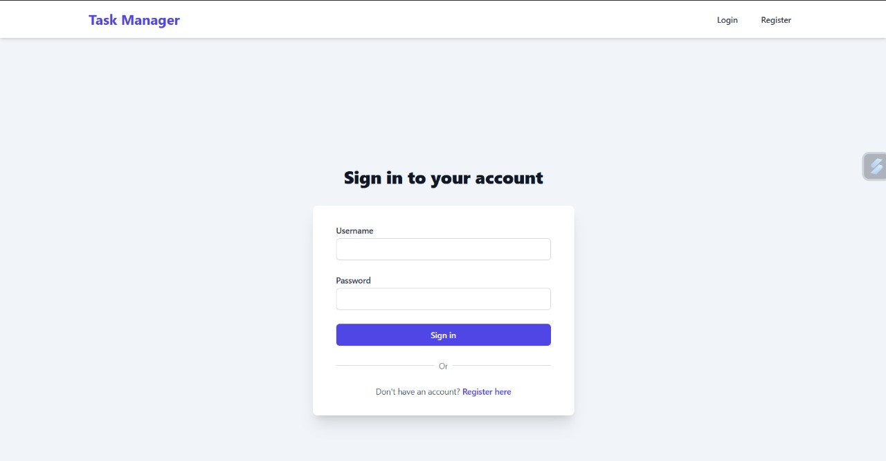
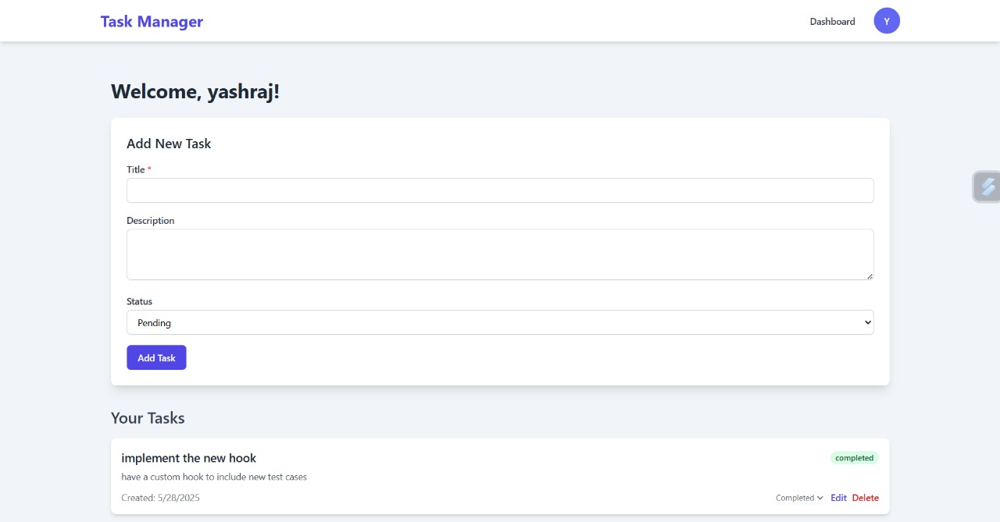
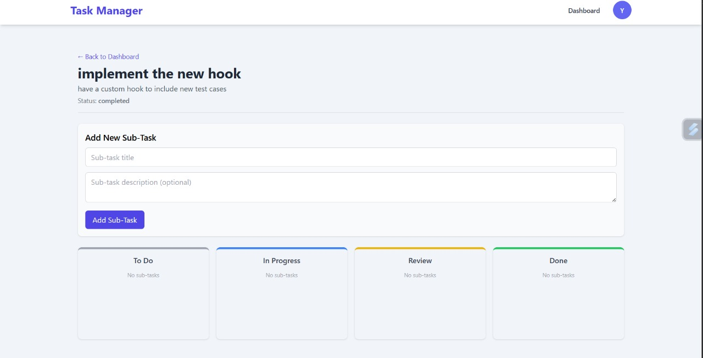

# Task Manager App (React + Node.js)

A full-stack web application for managing tasks, allowing users to register, log in, and perform CRUD operations on their tasks and sub-tasks using a Kanban-style board for sub-task management.


## Screenshots





## Features

*   **User Authentication:**
    *   User registration and login with JWT-based authentication.
    *   Password hashing for security.
    *   Protected routes requiring authentication.
*   **Task Management (CRUD):**
    *   Create, Read, Update, and Delete main tasks.
    *   Tasks are user-specific (users can only manage their own tasks).
*   **Sub-Task Management (Kanban Style):**
    *   View a detailed page for each main task.
    *   Create, Read, Update, and Delete sub-tasks for a parent task.
    *   Organize sub-tasks in a Kanban board with columns: "To Do", "In Progress", "Review", "Done".
    *   Change sub-task status to move them between Kanban columns.
*   **Responsive UI:**
    *   User interface styled with Tailwind CSS for a modern look and feel.
    *   Basic responsiveness for different screen sizes.

## Tech Stack

**Frontend:**
*   React.js (with Vite)
*   React Router DOM (for client-side routing)
*   Axios (for API requests)
*   Tailwind CSS (for styling)
*   React Context API (for global state management - authentication)

**Backend:**
*   Node.js
*   Express.js (web framework)
*   MongoDB (NoSQL database)
*   Mongoose (ODM for MongoDB)
*   JSON Web Tokens (JWT) (for authentication)
*   bcryptjs (for password hashing)
*   CORS (for cross-origin requests)
*   dotenv (for environment variables)

**Development Tools:**
*   Nodemon (for automatic backend server restarts)
*   VS Code (or your preferred editor)
*   Postman (or similar for API testing)

## Prerequisites

Before you begin, ensure you have met the following requirements:
*   Node.js (v16.x or higher recommended)
*   npm (Node Package Manager) or yarn
*   MongoDB installed and running locally, or a MongoDB Atlas connection string.

## Project Setup

1.  **Clone the repository:**
    ```bash
    git clone https://github.com/yashraj2310/Task-Manager.git
    cd TaskManagerApp # Or your project's root folder name
    ```

### Backend Setup (`server-side`)

1.  **Navigate to the backend directory:**
    ```bash
    cd server-side
    ```

2.  **Install dependencies:**
    ```bash
    npm install
    ```

3.  **Create a `.env` file** in the `server-side` directory and add the following environment variables:
    ```env
    PORT=5001
    MONGODB_URI=your_mongodb_connection_string_here 
    # Example: mongodb://localhost:27017/taskmanagerapp
    # Example Atlas: mongodb+srv://<user>:<password>@clustername.mongodb.net/taskmanagerapp?retryWrites=true&w=majority
    JWT_SECRET=yourSuperStrongAndSecretKey!
    ```
    *Replace placeholders with your actual values.*

4.  **Run the backend development server:**
    ```bash
    npm run dev
    ```
    The backend server should now be running on `http://localhost:5001` (or your specified PORT).

### Frontend Setup (`client-side`)

1.  **Navigate to the frontend directory (from the project root):**
    ```bash
    cd client-side 
    # If you are already in server-side, do: cd ../client-side
    ```

2.  **Install dependencies:**
    ```bash
    npm install
    ```

3.  **Run the frontend development server:**
    ```bash
    npm run dev
    ```
    The frontend application should now be accessible at `http://localhost:5173` (or the port Vite assigns).

## API Endpoints

A brief overview of the main API endpoints:

**Authentication (`/api/auth`)**
*   `POST /register`: Register a new user.
*   `POST /login`: Login an existing user.

**Tasks (`/api/tasks`)**
*   `POST /`: Create a new task.
*   `GET /`: Get all tasks for the logged-in user.
*   `GET /:taskId`: Get a single task by ID (with its sub-tasks).
*   `PUT /:taskId`: Update a task.
*   `DELETE /:taskId`: Delete a task.

**Sub-Tasks (`/api/tasks/:taskId/subtasks`)**
*   `POST /`: Create a new sub-task for a parent task.
*   `GET /`: Get all sub-tasks for a parent task.
*   `PUT /:subTaskId`: Update a sub-task.
*   `DELETE /:subTaskId`: Delete a sub-task.

